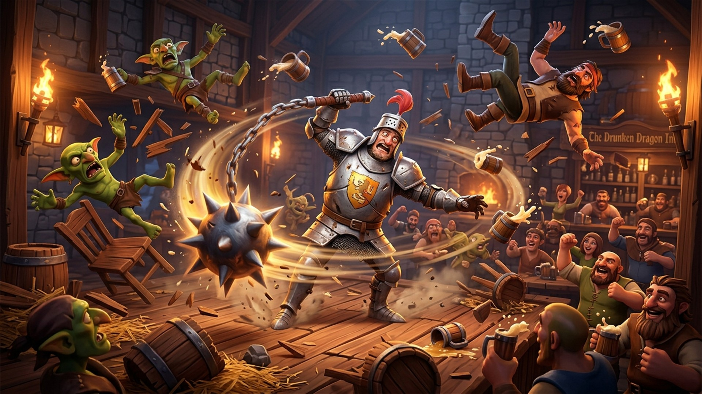

# Wobbly Knight: Tavern Brawl

A chaotic 3D physics-based isometric roguelite action game built with Three.js, TypeScript, and Vite. Spin momentum-driven flails, ragdoll unruly tavern goblins into tables and walls, collect ale mugs, unlock permanent armory perks, and defeat multi-phase bosses.



## Game Features

- **Physics & Ragdoll Chaos:** Spring-damped wobbly character movement with dynamic centrifugal flail physics and ballistic enemy impact impulses.
- **Tavern Armory & Heroes:**
  - **3 Playable Heroes:** Classic Knight (Whirlwind Dash), Golden Paladin (Holy Stomp), and Drunk Barbarian (Ale Frenzy).
  - **3 Distinct Weapons:** Balanced Morningstar, Spiked Battle Cleaver, and Dual Twin Flails.
  - **3 Arena Environments:** Cozy Tavern Pit, Gloomy Dungeon Crypt, and Grand Royal Courtyard.
- **Boss Fights & Elite Foes:** Multi-phase battles against The Giant Butcher (Wave 5), The Goblin King (Wave 10), and The Executioner (Wave 15+), plus ranged Drunken Bombers, Armored Shield Guards, and Vampire Ghouls.
- **Meta-Progression & Shop:** Bank collected ale mugs across runs to permanently upgrade Max Hearts, Weapon Damage, Ale Magnet, and Dash Cooldowns.
- **In-Run Roguelite Synergy:** 3-card perk level-up choices including Chain Lightning, Vampiric Ale, Spiked Trail, Cleave Momentum, and Heavy Spikes.
- **Zero Asset Dependencies:** Entire audio soundscape is procedurally synthesized via the Web Audio API. Total production package is only ~171 KB.
- **Multi-Language Support (i18n):** English, Russian, Polish, and Spanish with live runtime switching.
- **CrazyGames SDK Integration:** Native support for gameplay lifecycle tracking, pause menu, and rewarded video ads.

## Controls

| Key | Action |
| --- | --- |
| **W, A, S, D** / **Arrows** | Move knight & whip flail momentum |
| **Space** | Hero Skill / Whirlwind Dash Slam |
| **Esc** | Pause Brawl / Settings / Retreat to Tavern |
| **Mouse Click** | Menu navigation & shop interactions |

## Tech Stack

- **Engine:** Three.js (WebGL2)
- **Language:** TypeScript (Strict, 0 comments, self-documenting)
- **Bundler:** Vite
- **Audio:** Web Audio API (procedural synthesis, 0 audio files)
- **Platform:** CrazyGames SDK v3 (Web)

## Development & Build

### Install dependencies
```bash
npm install
```

### Run local dev server
```bash
npm run dev
```

### Build & package for web portals
```bash
npm run pack
```
This generates a production zip bundle (`wobbly-knight-web.zip`) with `index.html` at the archive root, fully compliant with CrazyGames, Poki, and GameDistribution requirements.
